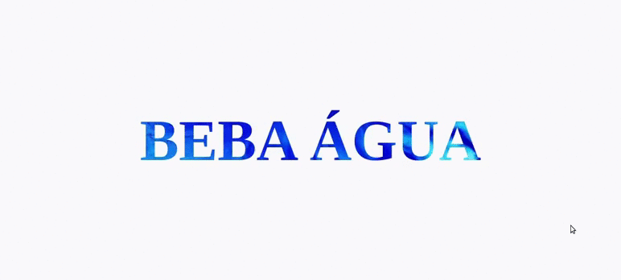
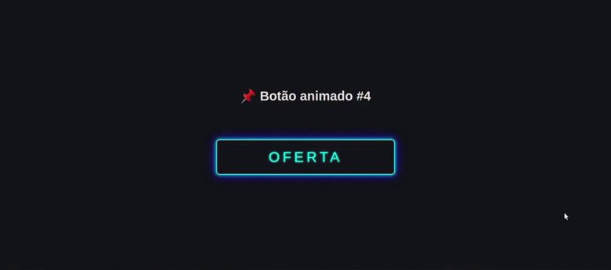
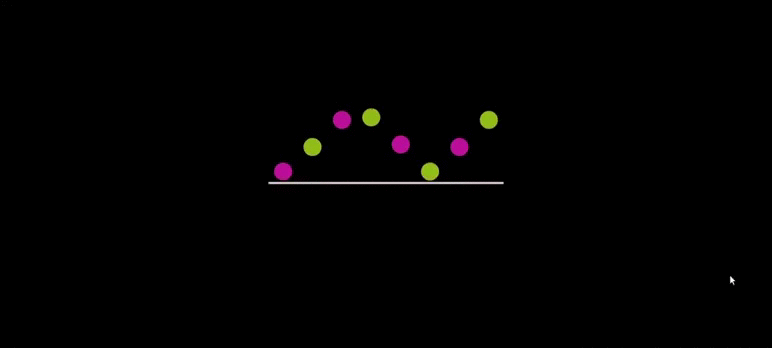
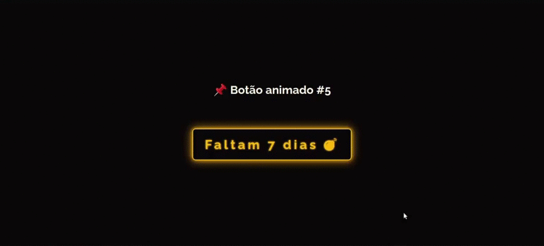
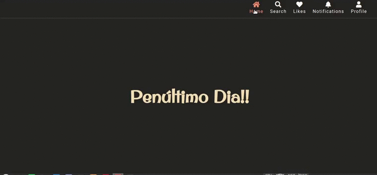

# Desafio 30 dias de CSS

### Day One

### Day Two

### Day Three

### Day Four

### Day Five

### Day Six

### Day Seven

### Day Eight

### Day Nine

### Day Ten

### Day Eleven

### Day Twelve

### Day Thirteen

### Day Fourteen

### Day Fifteen

### Day Sixteen

### Day Seventeen

### Day Eighteen

### Day Nineteen

### Day Twenty

### Day Twenty One

### Day Twenty Three

### Day Twenty Four

### Day Twenty Five

### Day Twenty Six

### Day Twenty Seven

### Day Twenty Eight

### Day Twenty Nine
