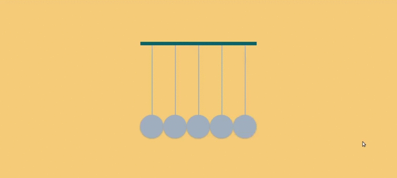
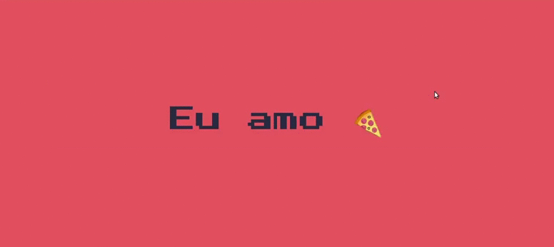
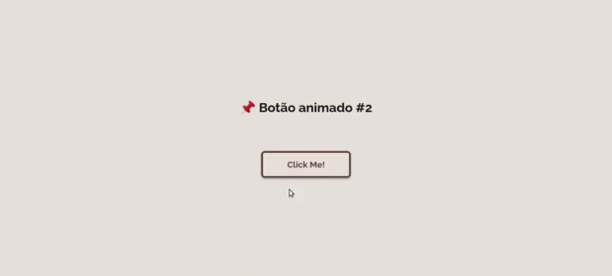
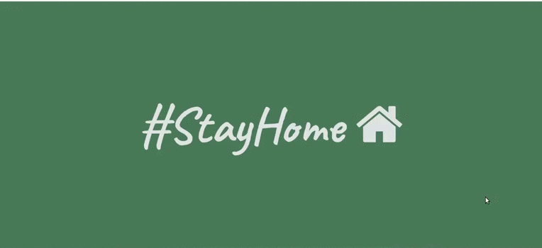
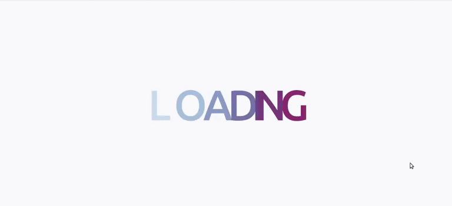

# Desafio 30 dias de CSS

### Day One

### Day Two

### Day Three

### Day Four

### Day Five

### Day Six

### Day Seven

### Day Eight

### Day Nine

### Day Ten

### Day Eleven

### Day Twelve

### Day Thirteen
